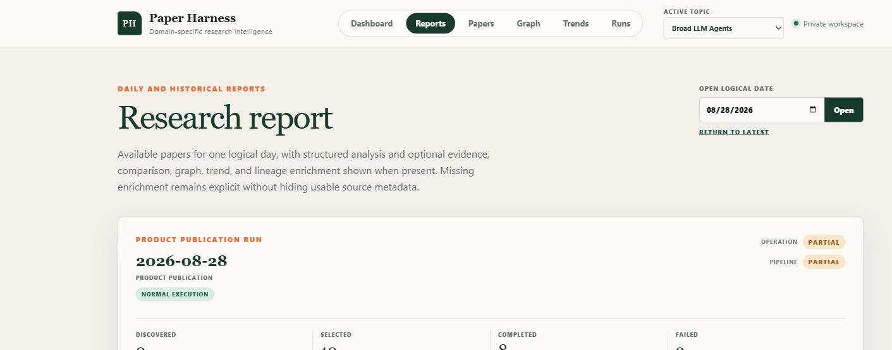
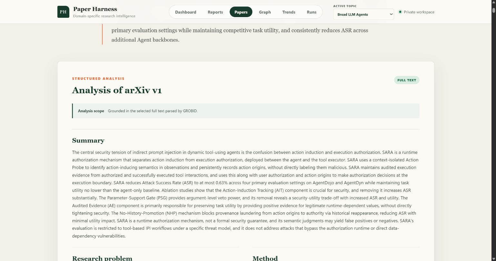
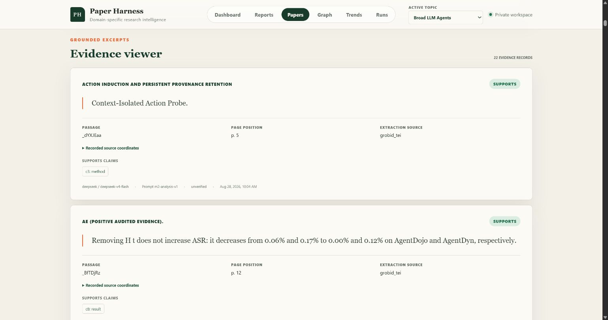
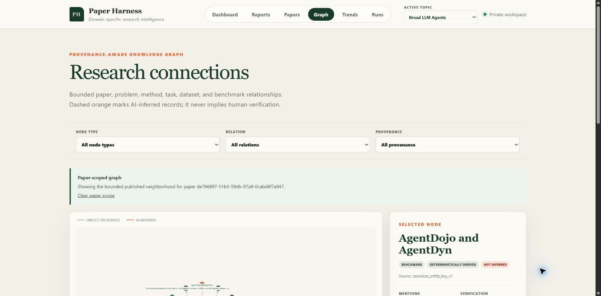
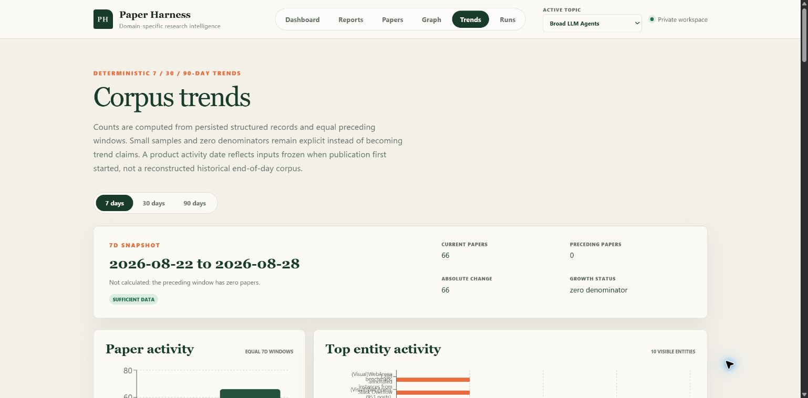

# Product Usage Guide

This guide introduces the main Paper Harness views using a captured, read-only
workspace. The navigation and availability labels are part of the product
contract: incomplete enrichment remains visible and does not hide independently
usable source metadata.

The screenshots contain public research-paper metadata and short evidence
excerpts. That content remains owned by its authors and upstream sources; its
appearance here does not relicense it under Apache-2.0. AI-generated summaries,
claims, comparisons, and inferred relations are unverified unless the interface
explicitly states otherwise.

## Navigate the workspace

Use the topic selector in the upper-right corner to switch between Broad LLM
Agents, Brain-Computer Interfaces, and World Models. Topic selection scopes the
Dashboard, Reports, Papers, Graph, Trends, and Runs views. A deep link to a
paper, comparison, lineage, or run preserves the relevant identity; selecting a
different topic returns to the corresponding topic-level view.

The screenshots show one captured state, including its dates, paper counts, and
availability. They demonstrate the interface rather than promising current or
exhaustive research coverage.

## Dashboard

The Dashboard answers "what changed in this research domain?" It summarizes
tracked papers, active topics, and the latest completed work, then surfaces the
current Daily publication and report. Status badges distinguish the overall
pipeline from the published product outcome.

Start here to:

- confirm the active topic;
- see whether the latest day is `COMPLETE`, `PARTIAL`, or `NO_UPDATE`;
- open the current report or report history; and
- move into papers, evidence, graph, trends, or run diagnostics.

## Daily and historical reports

Reports group one topic's publishable results by logical date. The date picker
opens a historical Daily publication, while "Return to latest" restores the
current result. The publication summary exposes discovered, selected,
completed, and failed counts before listing paper cards and optional
enrichment.

A `PARTIAL` report remains usable: paper cards with valid source metadata stay
visible, and failed stages and stable error codes explain what is missing.
`NO_UPDATE` means the pipeline completed normally but found no newly eligible
paper for that topic and date.

## Papers and structured analysis

The Papers view lists canonical papers and explicit arXiv versions. Opening a
paper shows bibliographic metadata, its source link, analysis scope, structured
summary, research problem, method, results, limitations, claims, related work,
comparisons, evidence, and lineage links when available.

The analysis-scope banner is important. `FULL TEXT` means the selected arXiv PDF
was parsed by GROBID before analysis. The product never silently turns a failed
full-text operation into abstract-only analysis. Model identity, prompt version,
generation time, and verification state are retained with generated records.

## Evidence viewer

The Evidence viewer connects concise source excerpts to the claims they support
or contradict. Each record identifies the exact paper version, section or
passage, page or coordinates when available, extraction source, and generation
provenance.

Use evidence links to inspect why a claim or relation appears. An excerpt is
traceability material, not independent validation of the paper's finding or the
model's interpretation.

## Knowledge graph

The Graph connects papers, research problems, methods, tasks, datasets, and
benchmarks. Filters narrow node type, relation type, and provenance. Selecting a
node opens its details and available mentions; paper-scoped graph links reduce
the view to a published neighborhood.

Visual style preserves provenance. Explicit or deterministically derived edges
are distinct from AI-inferred edges, and inference never implies human
verification. Follow a node's lineage link to inspect the bounded research path
behind it.

## Corpus trends

Trends compare persisted structured records across equal 7-, 30-, or 90-day
windows. The page shows current and preceding counts, absolute change, growth
status, paper activity, and top-entity activity.

Trend values are deterministic calculations, not model-generated statistics.
Zero denominators, small samples, and insufficient preceding windows stay
explicit instead of becoming unsupported growth claims.

## Runs, comparisons, and lineages

The remaining product routes provide deeper inspection:

- **Runs** shows pipeline executions, terminal state, duration and accounting,
  plus item-level stages and stable failures. It is the first place to inspect
  an unexpected `PARTIAL` or `FAILED` result.
- **Comparisons** presents structured dimensions for a new paper and compatible
  historical work, along with comparability and evidence links. Missing or
  incompatible historical analysis remains an availability state.
- **Lineages** traces a bounded, provenance-aware path through papers and graph
  entities. It does not claim an exhaustive history of a field.

## Interpret availability and trust labels

- `COMPLETE`: usable Daily source metadata was published; optional enrichment
  may still be unavailable.
- `PARTIAL`: usable metadata was published, but one or more selected papers
  failed core metadata or source-analysis processing.
- `NO_UPDATE`: a normal complete publication with no newly eligible papers.
- `FAILED`: a run-level configuration, authentication, source, persistence, or
  publication boundary prevented a usable publication.
- `UNVERIFIED` or AI-inferred provenance: generated content has not been
  confirmed by a human.
- `INSUFFICIENT_DATA` or another unavailable label: the product intentionally
  declines to fill a missing evidence, comparison, graph, trend, or lineage
  input.

For the precise rules, see the [Failure policy](FAILURE_POLICY.md) and
[Product and trust boundaries](BOUNDARIES.md). Return to the
[README](../README.md) for local setup, API examples, and pipeline operation.
